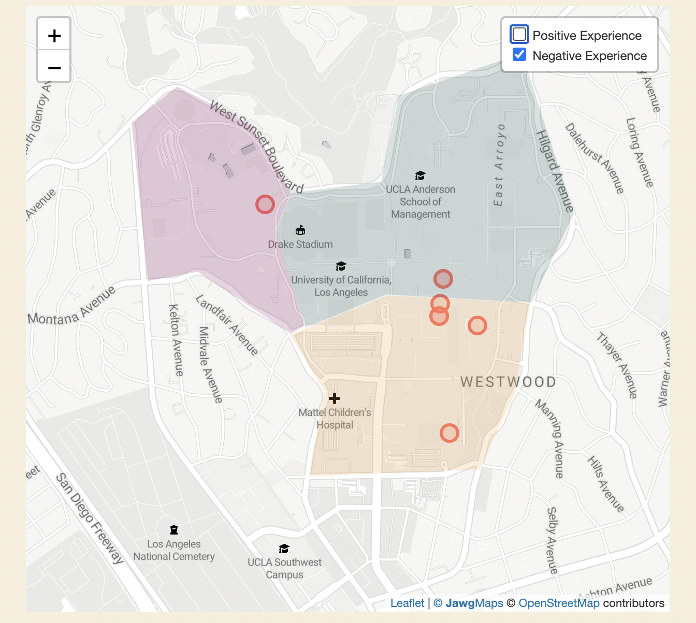

### UCLAsian-American Bruin Stories

## Table of contents
* [Objective](#Objective)
* [Community](#Community)
* [Technology Used](#technology-used)
* [Features](#Features)
* [Future use](#Future-use)
* [Acknowledgments](#Acknowledgements)
* [Contact](#Contact)

## Objective
The objective of our project is to provide an open platform for Asian-American students to anonymously share stories of academic experiences they’ve had at UCLA. The Asian American community does face a large number of problems, and it can be daunting for members of the community to seek out the help they need.  There is a lot of focus on success and achievement in the Asian American community, and such pressure can negatively affect students here. Asian American students are often forced by family/society in general to overachieve in school. This can be an isolating experience, and seeking out help is often stigmatized. Our hope is that Asian American students will be able to share their experiences dealing with their struggles at UCLA so that we have a better understanding of the diverse experiences that community members face. 

## Community
Our project is intended for the Asian American student community at UCLA. The community here at UCLA is diverse, with many Asian American students coming from low income and first generation backgrounds. However, the entire community is stereotyped as a "model minority" and are treated as a monolith. This is especially seen with academics, as students are stereotyped as "smart". We want to highlight all the varied and diverse experiences of the community.  

## Technology Used
For this project, we used HTML, CSS (for the design of the site; it is the styles folder), and Javascript (for functionality, see the js folder) for the overall site. In order to collect responses, we used Google Forms. Then, we used Google Sheets, App Script, and Papaparse to process those responses for addition to our site. For the map, we used Leaflet.js for the basemap and to plot markers for the location of each response; we also used Turf.js to visualize the responses by area of campus (North Campus, South Campus, and The Hill dormitories). 

## Features
<ol>
  <li>Hover Regions</li>
  
  
The map is split into 3 different significant regions at UCLA: The Hill, North Campus, and South Campus. Users can hover over each region to see how many responses are mapped to that location.

  <li>Story Sidepanel</li>
  
  
Upon clicking on a region, the side panel will be populated with all of the responses tied to points within that region, color coded by positive and negative experiences. 

  <li>Filter</li>
  
  
Users can filter the markers on the map by positive or negative experiences.

</ol>

## Future use
With regards to the future of our mapplication, we desire to transfer back the ownership to the users of the site - Asian American UCLA students who are facing difficulties in colleges as a result of their background. In order to facilitate this, we intend to reach out to organizations such as the UCLA Asian-Pacific Coalition and the UCLA First to Go organization. These organizations work with Asian American students, and we think it will be valuable for them to use this application in their efforts of improving the experience of Asian American students. We hope that the experiences that are shared by community members are used in order to tailor resources to better meet the needs of Asian Americans at UCLA. 

## Acknowledgements
Special thank you to our professor, Albert Kochaphum, for teaching ASIAN AM 191A, where we weere able to learn and apply all of the tools we used to build this mapplication. We wouldn't have been able to complete this without his guidance throughout this quarter! We'd also like to thank our classmates for participating in our surveys and giving feedback to help us build the best version of this mapplication. 

## Contact
If you have any questions, comments, or concerns, please feel free to contact us! 

<ul>
  <li>Ivy Tang: ivyjiatang@g.ucla.edu</li>
  <li>Nishaanth Krishnan: nishaanthk@g.ucla.edu</li>
</ul>

